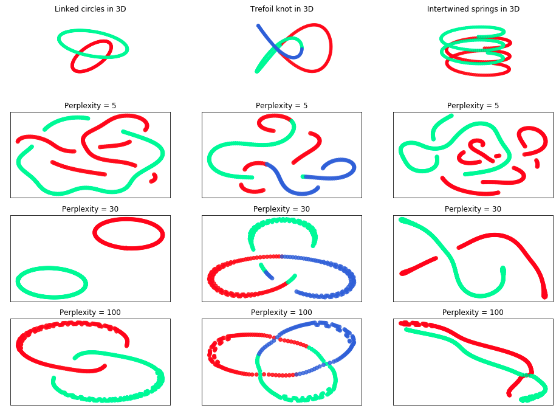
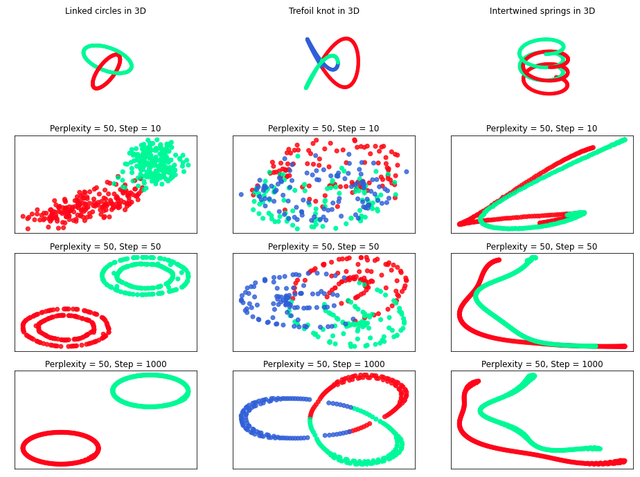

# Implementation of t-SNE in Python

Reference paper: "Visualizing Data using t-SNE" by Laurens van der Maaten and Geoffrey Hinton

## Description

This repository contains the source code for a new package, `tsne663`, as well as an `.ipynb` file to generate a reproducible report. Producing `final_paper.pdf` requires multiple steps, which include downloading data, generating and saving plots, and running code within `Implementing t-SNE in Python with Optimized Code and Examples.ipynb`, all of which take a non-negligible amount of time. To make this process more modular, we use a `Makefile`, and `final_paper.pdf` can be reproduced by simply navigating to this repository in the terminal and typing `make`. For aesthetics, the `Makefile` is configured to not show any code in `final_paper.pdf`.

## Installation

To install this package, one can navigate to this Github repository and run `python setup.py install`. 

Upon installation, the following prerequisites will also be installed (versions shown are those used during development, which ensures that the package will work properly):

- `matplotlib` - 3.1.1
- `numpy` - 1.18.1
- `numba` - 0.48.0
- `tqdm` - 4.42.0
- `sklearn` - 0.22.1

Two additional packages, while not automatically installed, are necessary to reproduce the results from the simulations:

- `plotly` - 4.5.0
- `textwrap` - 3.9.4

## Package functions

The `tsne663` package contains functions to (1) implement t-SNE and (2) test / visualize t-SNE on simulated data. Below, we provide brief descriptions of the key functions:

- `tsne`: Takes in data matrix (and several optional arguments) and returns low-dimensional representation of data matrix with values stored at each iteration
- `make_two_blobs`, `make_parallel_lines`, `make_two_3d_circles`, `make_trefoil_knot`, `make_springs`: Generate data (according to optional arguments) that are well suited to showcase t-SNE's ability to separate clusters
- `perp_plots`, `step_plots`: Creates plots of t-SNE performed on a single dataset for a set of specified perplexity values or iteration numbers
- `compare_plots`: Creates grid of plots to showcase t-SNE's performance on multiple datasets across a range of perplexity values or iteration numbers

## Selected simulation results

####t-SNE results for various perplexity values on 3D shapes**

####Evolution of t-SNE results by iteration number on 3D shapes**

## Skills on display

This project was completed as part of STA 663 (Computational Statistics and Statistical Computing) at Duke, taught by Professor Cliburn Chan. I partnered with two classmates, Marc Brooks and Steven Winter, on this project. We all contributed to the base code of the `tsne663` package, which required understanding an academic publication to the level of depth necessary to reproduce results. For the final report, I focused on testing our t-SNE implementation on simulated data and making our research reproducible by creating a Makefile.

## References

- L.J.P. van der Maaten and G.E. Hinton. Visualizing High-Dimensional Data Using t-SNE. Journal of Machine Learning Research 9(Nov):2579-2605, 2008.
- Vin de Silva and Joshua B. Tenenbaum. Global Versus Local Methods in Nonlinear Dimensionality Reduction. Proccedings of the 15th International Convference on Neural Information Processing Systems. Jan 2002.
- Dmitry Kobak, George Linderman, Stefan Steinerberger, Yuval Kluger, and Philipp Berens. Heavy-tailed Kernels Reveal a Finer Cluster Structure in t-SNE Visualisations. ECML PKDD 2019. doi: 10.1007/978-3-030-46150-8_8
- L.J.P. van der Maaten. Apr 2021. https://lvdmaaten.github.io/tsne/.
- Wattenberg, et al., "How to Use t-SNE Effectively", Distill, 2016. http://doi.org/10.23915/distill.00002
- Yann LeCun, Corinna Cortes, and Christopher J.C. Burges. The MNIST Database. Apr 2021. http://yann.lecun.com/exdb/mnist/.
- UCI Machine Learning Respository. Gene expression Cancer RNA-seq Data Set. Jun 2016. https://archive.ics.uci.edu/ml/datasets/gene+expression+cancer+RNA-Seq#.
- Allen Institute for Brain Science. Human M1 10x. Apr 2021. https://portal.brain-map.org/atlases-and-data/rnaseq/human-m1-10x.
- "Columbia Object Image Library (COIL-20)," S. A. Nene, S. K. Nayar and H. Murase, Technical Report CUCS-005-96, February 1996.
